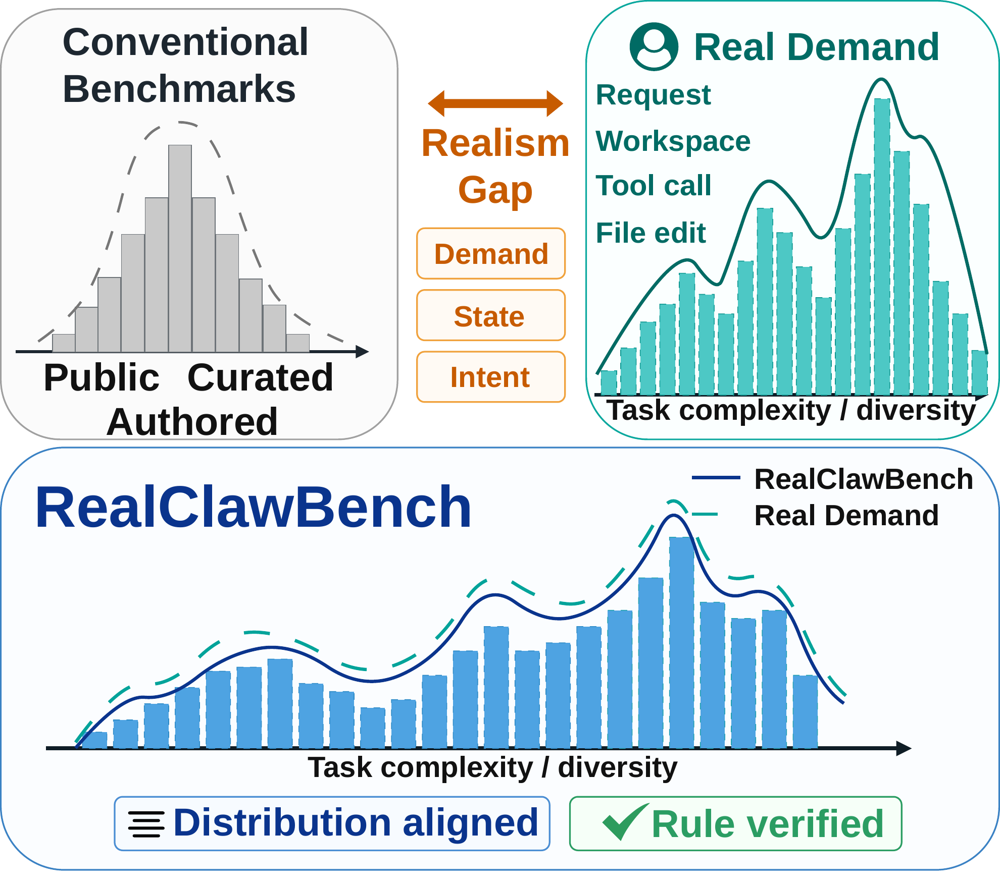
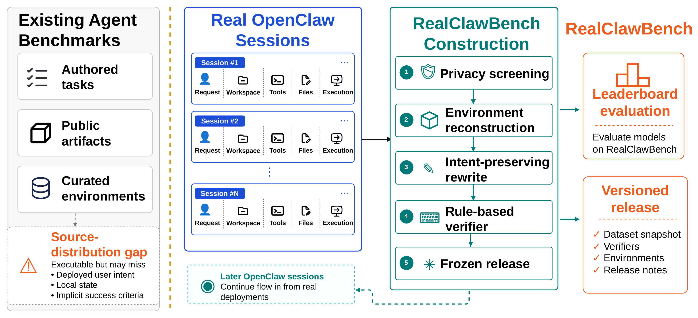
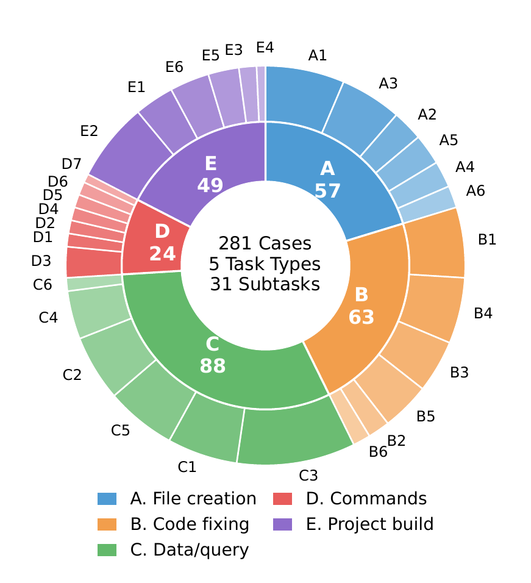
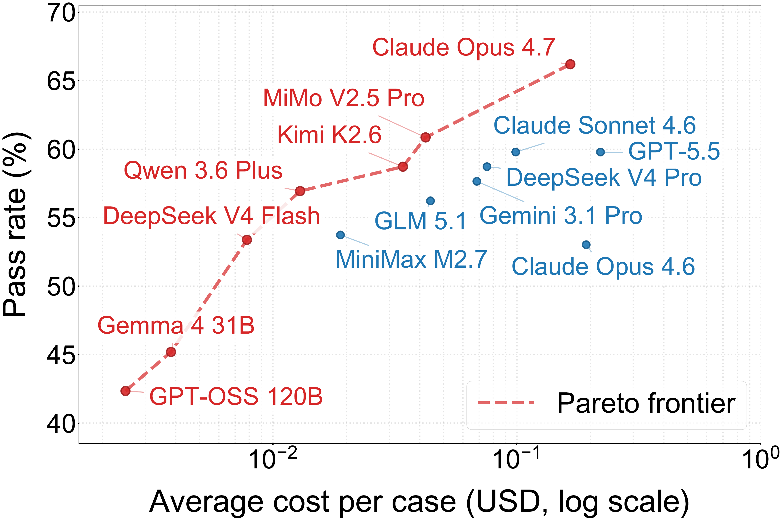

# RealClawBench

<p align="center">
  <a href="https://realclawbench.github.io/">
    
  </a>
</p>

<p align="center">
  <strong>Live OpenClaw Benchmarks from Real Developer-Agent Sessions</strong>
</p>

<p align="center">
  <a href="https://realclawbench.github.io/">Overview</a>
  ·
  <a href="https://realclawbench.github.io/distribution.html">Task Distribution</a>
  ·
  <a href="https://realclawbench.github.io/leaderboard.html">Leaderboard</a>
  ·
  <a href="https://realclawbench.github.io/realclawbench_paper.pdf">Paper</a>
</p>

<p align="center">
  <a href="https://realclawbench.github.io/leaderboard.html"></a>
  
  
  
  
</p>

## Overview

RealClawBench is a live benchmark framework built from real OpenClaw developer-agent sessions. Instead of starting from manually authored tasks or public artifacts alone, RealClawBench reconstructs real user requests into reproducible, privacy-screened, automatically scored benchmark cases.

Each released task contains:

- a standalone instruction rewritten from a real OpenClaw session,
- a sanitized initial workspace,
- a deterministic, case-specific verifier,
- task metadata for release tracking, task-type scoring, and long-tail analysis.

The first frozen release contains **281 executable tasks** across **5 task types** and **31 subtasks**. In the paper leaderboard, the strongest evaluated system solves **65.8%** of tasks, leaving substantial headroom on realistic developer-agent workloads.

## Website

The public benchmark website is deployed with GitHub Pages:

| Page | Description |
| --- | --- |
| [Overview](https://realclawbench.github.io/) | Motivation, construction pipeline, and main experimental highlights. |
| [Task Distribution](https://realclawbench.github.io/distribution.html) | The 281-case task taxonomy, construction funnel, and subtask distribution. |
| [Leaderboard](https://realclawbench.github.io/leaderboard.html) | Main 281-case leaderboard and the live 34-case extra-quality subset. |

## Key Figures

### From Real Sessions to Versioned Releases

<p align="center">
  
</p>

RealClawBench converts real OpenClaw sessions into benchmark releases through privacy screening, environment reconstruction, intent-preserving rewriting, rule-based verifier construction, and frozen release packaging.

### Real-Demand Task Distribution

<p align="center">
  
</p>

The released benchmark is intentionally not manually balanced. Frequent real workflows shape the sample-average score, while task and subtask macro-averages expose long-tail robustness.

### Accuracy and Cost Tradeoff

<p align="center">
  
</p>

The leaderboard reports accuracy, robustness, and cost together. Higher spending does not directly imply higher verifier success, and current frontier models still leave a large fraction of realistic developer-agent tasks unsolved.

## Repository Structure

```text
.
├── index.html                  # Overview page
├── distribution.html           # Task distribution page
├── leaderboard.html            # Leaderboard page
├── realclawbench_paper.pdf     # Paper PDF
├── assets/
│   ├── app.js
│   ├── styles.css
│   └── figures/                # Paper figures used by the site and README
└── data/
    ├── releases.json
    ├── results_main.json
    ├── results_live.json
    └── task_distribution.json
```

## Metrics

The primary leaderboard metric is **Sample**, the case-level micro-average verifier pass rate on the frozen release. The website also reports:

- **Task Avg.**: macro-average over the 5 top-level task types,
- **Subtask Avg.**: macro-average over the 31 subtasks,
- **pass@3**: fraction of cases solved at least once across three runs,
- per-task scores for file creation, code fixing, data/codebase querying, command execution, and project building.

All leaderboard rankings are computed from deterministic verifiers, not LLM judges.

## Live Benchmarking

The main 281-case release stays frozen for controlled comparison. Later non-overlapping OpenClaw windows can be processed with the same construction protocol and published as separate live releases, allowing RealClawBench to track temporal demand shift without silently changing historical leaderboard results.
